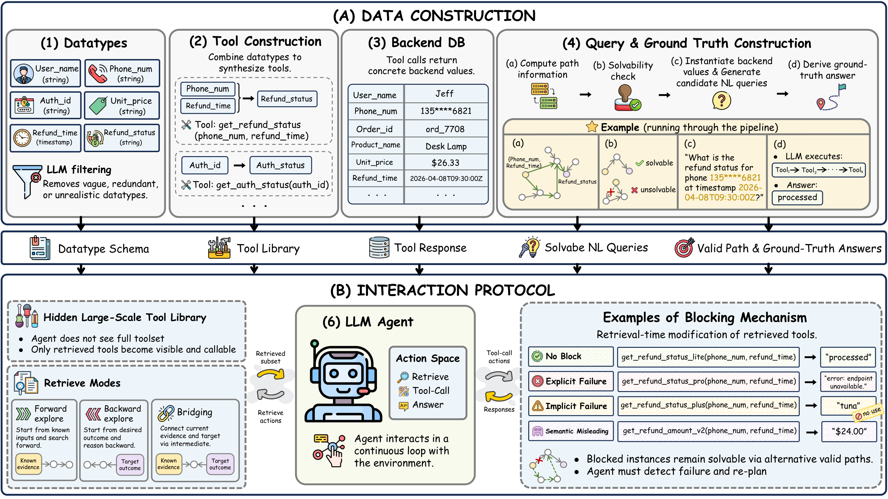
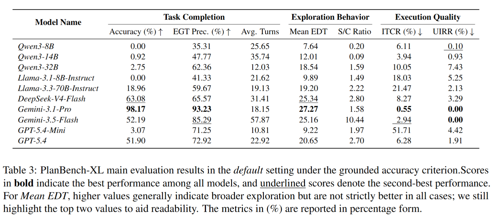

# PlanBench-XL [Under Construction]



<p align="center">
  <a href="https://arxiv.org/pdf/2606.22388">
    
  </a>
  <a href="https://huggingface.co/datasets/JiayuJeff/PlanBench-XL">
    
  </a>
  <a href="https://planbench-xl.github.io/">
    
  </a>
  <a href="#citing-this-work">
    
  </a>
</p>

This is the official repository for **PlanBench-XL**, a benchmark for evaluating LLM agents' **long-horizon planning with massive tool ecosystems** under retrieval noise and path-preserving blocker events.

## 🎯 Project Overview

**PlanBench-XL** tests whether tool-use agents can solve retail planning tasks when they cannot see the whole tool universe at once. At each turn, the agent may retrieve relevant tools, call an available tool, or submit a final answer. The runtime tracks discovered tools, trusted and untrusted intermediate values, executable traces, and final-answer correctness.

The current release contains a retail-domain benchmark with **327 queries**, **56 datatypes**, and **1,665 tools**.

## ✨ Core Features

- **Massive Tool Retrieval**: Agents retrieve tools from a large tool ecosystem instead of receiving a complete tool list up front.
- **Long-Horizon Planning**: Ground-truth solution paths span at least 5 tool steps, requiring multi-step composition across intermediate values.
- **Noisy Tool Ecosystem**: Retrieved executable tools can be augmented with noisy sibling tools.
- **Path-Preserving Blockers**: Blocker configurations simulate corrupted tool access by injecting explicit, implicit, and semantic-misleading failures, while preserving at least one valid solution path for each query.
- **Detailed Evaluation**: The evaluator reports answer accuracy, turn counts, search/call balance, invalid tool-call rates, noisy-tool usage, and executed ground-truth datatype coverage.

## 📊 Main Results



## 🚀 Quick Start

### Installation

```bash
# Clone the repository
git clone <repo-url>
cd PlanBench-XL

# Install dependencies
pip install openai pyyaml requests httpx tqdm
```

Python 3.10 or newer is recommended. Run commands from the repository root.

### Environment Configuration

1. **API Models**

   Configure your API key and OpenAI-compatible base URL:

   ```bash
   cp src/env/config/.env.example src/env/config/.env
   source src/env/config/.env
   ```

   Then edit `src/env/config/.env`:

   ```bash
   export OPENAI_API_KEY="your-api-key"
   export OPENAI_BASE_URL="your-base-url"
   ```

   Model YAMLs are stored in `src/env/config/models/openai/` and registered in `src/env/config/model_registry.yaml`.

2. **Local Models**

   Local model configs use OpenAI-compatible endpoints, for example:

   ```yaml
   base_url: http://127.0.0.1:8001/v1
   api_key: EMPTY
   ```

   Edit the corresponding `*-local.yaml` file if your local server uses a different port.

### Running the Benchmark

Run one YAML configuration:

```bash
python src/env/run.py \
  --run_config src/env/config/runs/retail/gpt-5.4/retail_gpt5.4_default.yaml
```

Run a blocker configuration:

```bash
python src/env/run.py \
  --run_config src/env/config/runs/retail/gpt-5.4/retail_gpt5.4_blocker.yaml
```

Override config fields from the command line:

```bash
python src/env/run.py \
  --run_config src/env/config/runs/retail/gpt-5.4/retail_gpt5.4_default.yaml \
  --set query_sample.size=20 \
  --set output.output_dir=retail/debug/gpt-5.4
```

Runtime outputs are written under `outputs/` by default. Each run directory contains:

```text
metadata.json               # merged configuration snapshot
result.jsonl                # completed per-query results
progress/index.json         # per-query progress index
progress/queries/*.json     # resumable per-query traces and checkpoints
```

### Batch Runs

List available retail run YAMLs:

```bash
python scripts/run_retail_batch.py --list
```

Run all non-local configs for one model:

```bash
python scripts/run_retail_batch.py --model gpt-5.4
```

Run selected configs only:

```bash
python scripts/run_retail_batch.py \
  --model gpt-5.4 \
  --config default,blocker
```

The batch helper skips `*-local` model directories by default. Include them only when the corresponding local OpenAI-compatible servers are running:

```bash
python scripts/run_retail_batch.py --include-local-models --model llama3.3-70b-local
```

To inspect local ports parsed from model YAMLs:

```bash
python scripts/run_retail_batch.py --list-local-model-ports
```

## 📖 Advanced Usage

### Run Configs

Retail run configs are located under:

```text
src/env/config/runs/retail/<model-name>/*.yaml
```

Common settings include:

- `model_ref`: Model registry key defined in `src/env/config/model_registry.yaml`.
- `data.*_file`: Retail dataset files used by the run.
- `output.output_dir`: Run-specific directory under `output.root_dir`.
- `runtime.max_steps`: Maximum action steps per query.
- `runtime.max_concurrency`: Number of concurrent query workers.
- `query_sample.size`: Optional number of queries to sample.
- `query_sample.seed`: Seed for deterministic query sampling.

### Noise Parameters

- `noise.mode`: `append_noisy_siblings` appends noisy sibling tools for retrieved primary tools.
- `noise.max_total_tools`: Maximum number of tools returned to the agent after augmentation.
- `noise.ratio`: Reserved in config; current retail run YAMLs use `ratio: 0.0` with `append_noisy_siblings`.

### Blocker Parameters

- `blocker.enable_block`: Enables runtime replacement of selected baseline tools.
- `blocker.selection_mode`: Supports path-targeted selection such as `target_remaining_paths` and `target_remaining_ratio`.
- `blocker.target_remaining_paths`: Target number of surviving ground-truth paths.
- `blocker.target_remaining_ratio`: Target ratio of surviving ground-truth paths.
- `blocker.fixed_noise_type`: Uses one blocker type, such as `explicit failures`, `implicit failures`, or `semantic misleading`.
- `blocker.fixed_noise_types`: Uses multiple blocker types for each selected baseline tool.
- `blocker.seed`: Seed used for blocker planning and reproducible final tool-order shuffling.
- `blocker.max_combo_candidates` / `blocker.max_cover_size`: Search limits for blocker selection.

### Model Parameters

Model YAMLs expose OpenAI-compatible request parameters:

- `model`: Provider model name sent to the API.
- `api_key_env` / `base_url_env`: Environment-variable based API credentials.
- `base_url` / `api_key`: Direct endpoint settings for local models.
- `request.temperature`: Sampling temperature.
- `request.max_tokens`: Maximum response tokens.
- `request.timeout_seconds`: Request timeout.

## 📦 Dataset

The retail benchmark data is stored in `src/data/retail/`:

| File | Description |
| :--- | :---------- |
| `datatypes.json` | Typed value schema used by tools and queries |
| `database.json` | Retail backend records used by executable tools |
| `baseline_tools.json` | Ground-truth executable tools |
| `noisy_tools.json` | Distractor tools associated with baseline tools |
| `blocker_tools.json` | Runtime replacement tools for blocker settings |
| `tasks.json` | Typed planning task definitions |
| `queries.json` | Natural-language benchmark queries and answers |
| `paths_set_catalog.json` | Ground-truth path sets for blocker planning and evaluation |

## 📈 Evaluating Results

Evaluate a completed or partially resumed run directory:

```bash
python src/env/evaluate.py \
  --output_dir outputs/retail/gpt-5.4/default
```

By default, this writes:

```text
outputs/retail/gpt-5.4/default/evaluation.json
```

The evaluation report includes:

- `accuracy` and `correct_count`
- mean and total turn counts
- explored datatype counts
- search-to-call ratio
- invalid tool-call and untrusted-input rejection rates
- noisy-tool usage rates
- executed ground-truth datatype precision and recall
- per-query traces and failure details

## 🔧 Extending

To add a new model:

1. Add a model YAML under `src/env/config/models/openai/`.
2. Register it in `src/env/config/model_registry.yaml`.
3. Add one or more run YAMLs under `src/env/config/runs/retail/<model-name>/`.
4. Run with `python src/env/run.py --run_config <your-run-yaml>`.

The current code release targets the retail domain.

## 🤝 Contributing

Contributions are welcome. Please open an issue or pull request for bug fixes, new model configs, or benchmark extensions.

<a id="citing-this-work"></a>

## 📚 Citing this work

```bibtex
@misc{liu2026planbenchxlevaluatinglonghorizonplanning,
  title={PlanBench-XL: Evaluating Long-Horizon Planning of LLM Tool-Use Agents in Large-Scale Tool Ecosystems},
  author={Jiayu Liu and Qihan Lin and Cheng Qian and Rui Wang and Emre Can Acikgoz and Xiaocheng Yang and Jiateng Liu and Zhenhailong Wang and Xiusi Chen and Heng Ji and Dilek Hakkani-Tür},
  year={2026},
  eprint={2606.22388},
  archivePrefix={arXiv},
  primaryClass={cs.AI},
  url={https://arxiv.org/abs/2606.22388},
}
```
